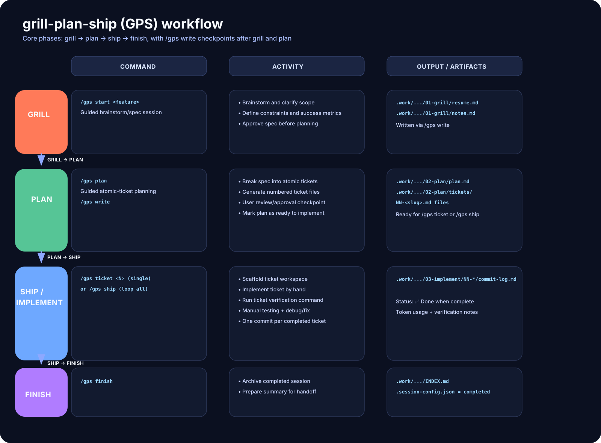

# grill-plan-ship

A structured workflow plugin for any code project.

**Workflow:** brainstorm (grill) → plan → implement (ship)

**Commands:**
- `/gps start <feature>` — Begin a feature
- `/gps write` — Save the current phase's output (brainstorm resume, or plan + tickets) to disk
- `/gps plan` — Create tickets
- `/gps ticket <N>` — Implement one ticket by hand
- `/gps ship` — Implement every remaining ticket in order, one commit each
- `/gps finish` — Archive session

## Workflow Visualization



GPS phases and outputs at a glance.

## Installation

```
/plugin marketplace add rtonneau/grill-plan-ship
/plugin install grill-plan-ship
```

Restart Claude Code.

## Quick Start

```
# In any project:
/gps start add-dark-mode
# ...brainstorming conversation happens automatically...
/gps write   # once approved, saves the resume to 01-grill/resume.md

# Plan tickets
/gps plan
# ...writing-plans + unslop happen automatically...
/gps write   # once approved, saves plan.md + tickets to disk

# Implement every ticket, one commit each
/gps ship

# Finish
/gps finish
```

## Session Structure

```
.work/sessions/YYYYMMDD__<feature>/
├── 01-grill/           ← Brainstorm output
├── 02-plan/            ← Plan + tickets
├── 03-implement/       ← Implementation logs
├── .session-config.json
└── INDEX.md
```

## Features

✅ Language-agnostic (works with any tech stack)
✅ Composable (uses superpowers + unslop)
✅ Documented (every session has INDEX.md)
✅ Versionable (.session-config.json tracks state)
✅ Token usage tracked per phase (grill, plan, each ticket)

## Token Usage

Every phase output (`01-grill/resume.md`, `02-plan/plan.md`, each ticket's `03-implement/NN-*/commit-log.md`) ends with a `## Token Usage` section reporting that phase's real input/output/cache token totals, parsed from Claude Code's own session transcripts. If the transcript can't be found or parsed, the section reads `unavailable` instead of blocking the write.

## Example Session

See `examples/` for real-world sessions:
- `geant4-chemistry-refactor/` — Scientific project
- `react-form-validation/` — Frontend project
- `python-etl-pipeline/` — Data project

## License

MIT
