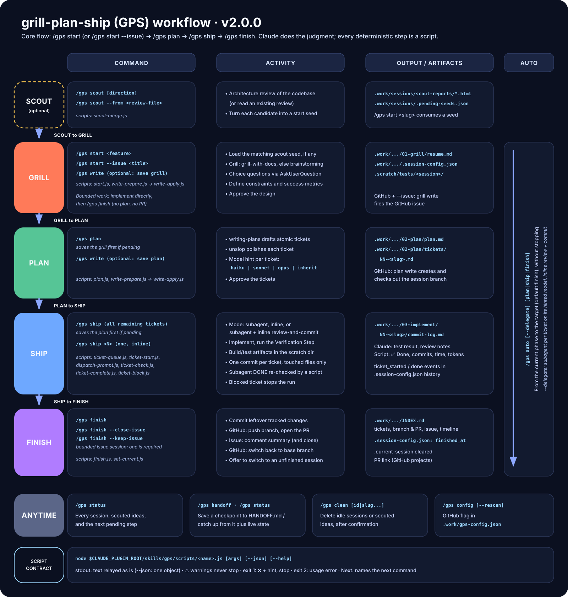

# grill-plan-ship

A Claude Code plugin that runs any code change through four phases:

**grill** (spec the work) → **plan** (atomic tickets) → **ship** (one commit per ticket) → **finish** (summary, and a pull request on GitHub projects).

Claude does the judgment work: asking questions, planning, reviewing and summarizing. Everything deterministic (session files, templates, validation, git and gh calls, report formatting) is done by small Node.js scripts with no dependencies.



## Installation

```
/plugin marketplace add rtonneau/grill-plan-ship
/plugin install grill-plan-ship
```

Restart Claude Code. Update later with `/plugin marketplace update rtonneau/grill-plan-ship`. Requires Node.js 20+. The grill and plan conversations work best with other plugins: `mattpocock-skills` (`grill-with-docs`) or `superpowers` (`brainstorming`), plus `superpowers` (`writing-plans`) and, optionally, `unslop`. Without them, `/gps` falls back to a built-in grill (an interview that also keeps a project glossary and ADRs in `.work/`, adapted from the `grilling` and `domain-modeling` skills of [mattpocock-skills](https://github.com/mattpocock/skills.git)) and drafts the tickets itself.

## Quick start

```
/gps start add-dark-mode   # creates the session, then the grill conversation starts
/gps plan                  # once the design is approved: saves it, then drafts tickets
/gps ship                  # once the tickets are approved: saves them, implements each, one commit each
/gps finish                # INDEX.md summary; on GitHub, pushes the branch and opens the PR
```

Or, once the direction is clear, `/gps auto` runs from wherever the session is to the end without stopping.

## Commands

| Command | What it does |
|---|---|
| `/gps scout [--from <review-file>] [direction]` | Turn an architecture review, or an existing review file, into ideas for `/gps start` |
| `/gps start [--issue] <name>` | New session, then the grill (`--issue`: a bug report, filed as a GitHub issue) |
| `/gps status` | Every session, scouted ideas, the current phase, a saved handoff, the next command |
| `/gps clean [id...]` | Delete old sessions or drop ideas, after showing exactly what goes |
| `/gps config [--rescan]` | Show, or detect again, whether the project uses GitHub |
| `/gps write` | Save the approved grill or plan to disk (`plan`, `ship` and `auto` do it for you) |
| `/gps plan` | Save the grill if pending, then draft tickets with model hints |
| `/gps ship [N]` | Save the plan if pending, then implement every remaining ticket (or only ticket N) |
| `/gps finish` | Close the session: leftovers committed, INDEX.md, PR |
| `/gps auto [--delegate] [plan\|ship\|finish]` | Run from the current phase to the target without stopping |
| `/gps handoff` | Save an in-flight checkpoint before you stop for the day |

### One example per command

```
/gps scout only review src/parser          # architecture scan of one area -> "/gps start <slug>" lines
/gps scout --from docs/review.md only Critical and High   # an existing review -> grouped ideas
/gps start runconfig-resolver              # a scouted idea: the grill opens with it already loaded
/gps start --issue crash when saving a large file          # a report; on GitHub it becomes issue #N
/gps status                                # "dark mode — ship · 1/3 done; next 02 persist" + Next: line
/gps clean 2026-08-01__old-spike           # dry run first, deletes only after your yes
/gps config --rescan                       # after adding a github.com origin or running gh auth login
/gps write                                 # save the approved design now, without starting the plan
/gps plan                                  # writing-plans drafts the tickets, unslop tightens them
/gps ship 3                                # implement only ticket 3, inline
/gps finish                                # for an issue session it asks "Close issue #N as well?"
/gps auto --delegate                       # subagent per ticket on its hinted model, reviewed and committed here
/gps handoff                               # HANDOFF.md: where you stopped, next step, settled decisions
```

## How `/gps ship` works

`/gps ship` asks once how to implement the tickets:

- **inline:** Claude implements each ticket in this session.
- **subagent:** each ticket goes to a fresh subagent on the ticket's `**Model:**` hint (`haiku`, `sonnet`, `opus` or `inherit`). The subagent commits through `ticket-complete.js`, and `ticket-check.js` verifies its DONE report before the next ticket starts.
- **subagent + inline follow-up:** the subagent implements and verifies; this session reviews the diff, re-runs the Verification Step, fixes what's needed and commits.

Only one implementer is ever live. A ticket that can't be finished is recorded with `ticket-block.js` and stops the run; it is never retried automatically. Each ticket's `commit-log.md` gets its test result and review notes from Claude, and its commit, time spent and token usage from the script.

## Layout

```
.claude-plugin/            plugin.json, marketplace.json
skills/gps/
├── SKILL.md               router: command table, script contract, shared rules
├── references/<cmd>.md    one short file per command (what Claude does, which script to run)
├── scripts/               one script per deterministic step
│   └── lib/               shared helpers (cli contract, session store, git, gh, phases, ...)
└── assets/                markdown templates
tests/                     one test per script (tests/lib/: one per lib), e2e and GitHub-flow tests
```

### Script contract

Every script in `skills/gps/scripts/` follows the same rules (see `scripts/lib/cli.js`):

- **Arguments:** positionals, then long options (`--flag`, `--name <value>`, `--name=<value>`, repeatable `--file`). `--json` and `--help` work everywhere.
- **stdout:** text meant to be relayed to the user as is, or with `--json` one JSON object.
- **stderr:** `⚠️  ` warnings; on failure `❌ <what failed>` plus a hint line.
- **Exit codes:** `0` success, `1` failure (a precondition or validation failed; nothing changed unless the message says so), `2` usage error.

| Script | Purpose |
|---|---|
| `start.js` | create a session (`--issue` for a report) and consume a matching scout seed |
| `status.js` | the status report |
| `clean.js` | list, `--dry-run` or `--delete` sessions and ideas |
| `config.js` | show or `--rescan [--apply]` the GitHub flag |
| `set-current.js` | switch the current session (only after the user confirms) |
| `write-prepare.js` | name the pending phase and print the payload skeleton to fill |
| `write-apply.js` | validate the payload and write resume.md or plan.md + tickets (creates the branch / files the issue on GitHub) |
| `plan.js` | start the plan phase |
| `ticket-queue.js` | the tickets, their state and model hints |
| `ticket-start.js` | prepare a ticket's workspace (next pending one by default); `--mode` records the ship mode the next `/gps ship` offers first |
| `dispatch-prompt.js` | the Agent tool call for a ticket's subagent |
| `ticket-complete.js` | commit the given files, mark the ticket Done, fill its log |
| `ticket-block.js` | record why a ticket can't be finished |
| `ticket-check.js` | verify a ticket really is complete |
| `finish.js` | close the session |
| `auto-route.js` | the steps `/gps auto` will run |
| `handoff.js` | write HANDOFF.md |
| `scout-merge.js` | archive a review and merge its ideas into the seeds |
| `domain-doc.js` | built-in grill: create `.work/GLOSSARY.md`, or the next numbered ADR in `.work/adr/` |

## Session files

```
.work/sessions/YYYY-MM-DD__<slug>/
├── 01-grill/resume.md            the approved design
├── 02-plan/plan.md               strategy + ticket overview
├── 02-plan/tickets/NN-<slug>.md  one spec per ticket (with an optional **Model:** line)
├── 03-implement/NN-<slug>/commit-log.md
├── HANDOFF.md                    /gps handoff
├── INDEX.md                      /gps finish: summary, links, timeline
└── .session-config.json          machine state: history, phase, usage, git branch/PR, issue
.work/gps-config.json             project flag: github.enabled
.work/GLOSSARY.md                 built-in grill: the project's domain terms
.work/adr/NNNN-<slug>.md          built-in grill: hard-to-reverse decisions and why
.scratch/tests/<session-id>/      build/run/test artifacts
```

`.work/` is committed with the code, each time in its own `chore(gps): …` commit: after the plan write (on the session branch), after each ticket (its completed commit log) and at `/gps finish` (INDEX.md and the finished state, pushed to the pull request before switching back). A bounded session's record is committed at finish only. Ticket commits themselves never include `.work/` files. `/gps start` adds `.scratch/` and the per-machine files (`.work/sessions/.current-session`, `.pending-seeds.json`, a write payload in progress) to `.gitignore`. If `.work/` is git-ignored (older gps versions added it), gps warns and commits none of it: remove the line to opt in. Since a session's files live on its branch, the commands find the session only with that branch checked out; when it isn't, the error names the branch to switch to. Every state change is appended to the session's `history` in `.session-config.json`; `/gps finish` turns it into a `## Timeline` table. The phase is always derived from the files, and `/gps status` flags any drift from the recorded one.

## GitHub projects

`.work/gps-config.json` says whether the project uses GitHub (`origin` on github.com and `gh auth status` succeeds). It is detected once; `/gps config --rescan` detects it again, and you can edit it by hand (e.g. for GitHub Enterprise).

- **Planned sessions:** saving the plan creates a session branch (`feat/…`, `fix/…`, named by Claude after the plan) from whatever is checked out. `/gps finish` commits leftover tracked changes, pushes, opens a PR against that base branch (or reuses an open one) and switches back to the base.
- **Bounded sessions** (grill only, no plan) stay on the current branch: no branch, no PR.
- **Issues:** `/gps start --issue` files the issue when the grill is saved. Bounded work gets a summary comment at finish (and, if you say so, the issue is closed). Planned work's PR says `Closes #N`.
- A failed push, `gh` call or switch never fails the finish: the commands to run by hand are printed and written to INDEX.md.

## Token usage

Each phase file (resume, plan, each commit log) ends with that phase's real token totals, read from Claude Code's session transcripts (sub-agents included). This relies on Claude Code's undocumented transcript layout, so it reads `unavailable` when the transcripts can't be found.

## Development

```
npm test                                  # every tests/**/*.test.js
node tests/check-skill-size.js --max 200  # the CI check: every SKILL.md at most 200 lines
```

## License

MIT
