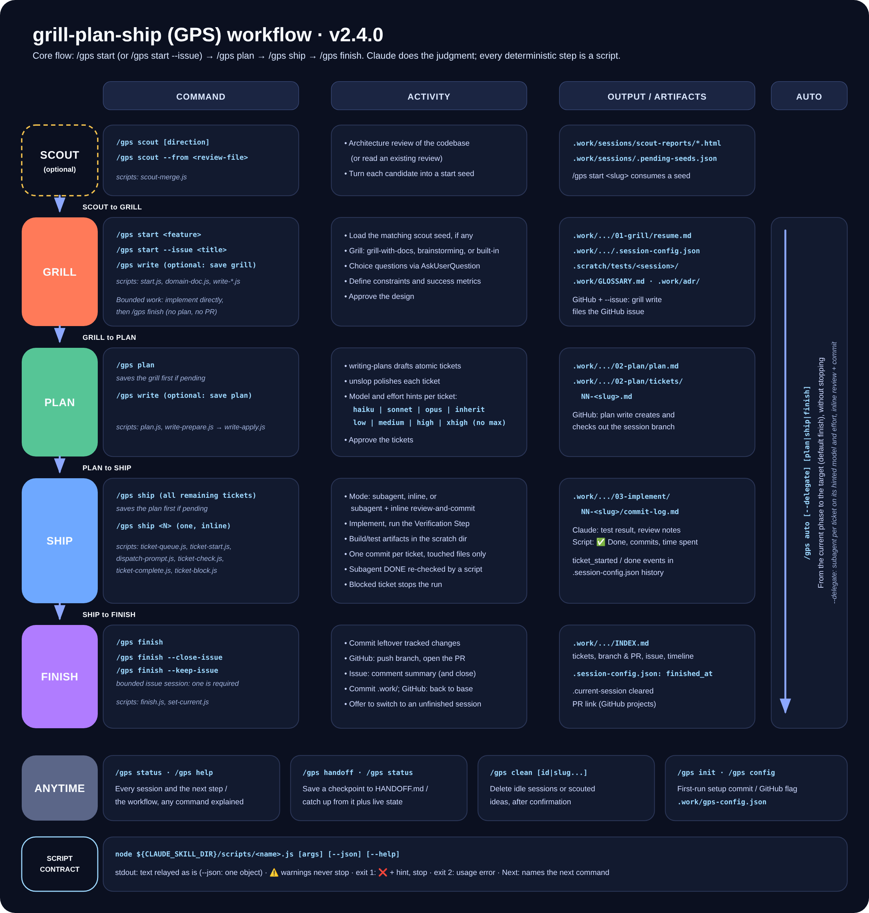

# grill-plan-ship

A Claude Code plugin that runs any code change through four phases:

**grill** (spec the work) → **plan** (atomic tickets) → **ship** (one commit per ticket) → **finish** (changelog entry, summary, and a pull request on GitHub projects) → **release** (when you choose).

Claude does the judgment work: asking questions, planning, reviewing and summarizing. Everything deterministic (session files, templates, validation, git and gh calls, report formatting) is done by small Node.js scripts with no dependencies.



## Installation

```
/plugin marketplace add rtonneau/grill-plan-ship
/plugin install grill-plan-ship
```

Restart Claude Code. Update later with `/plugin marketplace update rtonneau/grill-plan-ship`.

**Requirements:** Claude Code, Node.js 20+ and git. The GitHub features (session branches, pull requests, issues) also need the [GitHub CLI](https://cli.github.com/) logged in; without it gps works locally. The grill and plan conversations work best with other plugins: `mattpocock-skills` (`grill-with-docs`) or `superpowers` (`brainstorming`), plus `superpowers` (`writing-plans`) and, optionally, `unslop`. Without them, `/gps` falls back to a built-in grill (an interview that also keeps a project glossary and ADRs in `.work/`, adapted from the `grilling` and `domain-modeling` skills of [mattpocock-skills](https://github.com/mattpocock/skills.git)) and drafts the tickets itself.

## Quick start

```
/gps init                  # optional, once per project: checks it and commits gps's setup
/gps start add-dark-mode   # creates the session, then the grill conversation starts
/gps plan                  # once the design is approved: saves it, then drafts tickets
/gps ship                  # once the tickets are approved: saves them, implements each, one commit each
/gps finish                # changelog fragment, INDEX.md summary; on GitHub, pushes the branch and opens the PR
/gps release               # when you choose: turns the changelog fragments into a version, a tag and a push
```

Or, once the direction is clear, `/gps auto` runs from wherever the session is to the end without stopping.

## Commands

| Command | What it does |
|---|---|
| `/gps init` | Optional first-run setup: check the project (git, GitHub, helper skills) and commit gps's `.gitignore` entries and config on their own |
| `/gps scout [--from <review-file>] [direction]` | Turn an architecture review, or an existing review file, into ideas for `/gps start` |
| `/gps start [--issue] <name>` | New session, then the grill (`--issue`: a bug report, filed as a GitHub issue) |
| `/gps status` | Every session, scouted ideas, the current phase, a saved handoff, the next command |
| `/gps clean [id...]` | Delete old sessions or drop ideas, after showing exactly what goes |
| `/gps config [--rescan]` | Show, or detect again, whether the project uses GitHub |
| `/gps write` | Save the approved grill or plan to disk (`plan`, `ship` and `auto` do it for you) |
| `/gps plan` | Save the grill if pending, then draft tickets with model and effort hints |
| `/gps ship [N]` | Save the plan if pending, then implement every remaining ticket (or only ticket N) |
| `/gps finish` | Close the session: changelog fragment, leftovers committed, INDEX.md, PR |
| `/gps auto [--delegate] [plan\|ship\|finish]` | Run from the current phase to the target without stopping |
| `/gps release` | Turn the changelog fragments into a version: suggest, bump, tag, push |
| `/gps handoff` | Save an in-flight checkpoint before you stop for the day |
| `/gps help [command\|question]` | Where you are and what to run next, what a command does, or an answer to any question about the workflow |

### One example per command

```
/gps init                                  # "GitHub: detected on" + one chore(gps): set up gps commit, after your yes
/gps scout only review src/parser          # architecture scan of one area -> "/gps start <slug>" lines
/gps scout --from docs/review.md only Critical and High   # an existing review -> grouped ideas
/gps start runconfig-resolver              # a scouted idea: the grill opens with it already loaded
/gps start --issue crash when saving a large file          # a report; on GitHub it becomes issue #N
/gps status                                # "dark mode — ship · 1/3 done; next 02 persist" + Next: line
/gps clean 2026-08-01__old-spike           # dry run first, deletes only after your yes
/gps config --rescan                       # after adding a github.com origin or running gh auth login
/gps write                                 # save the approved design now, without starting the plan
/gps plan                                  # writing-plans drafts the tickets, unslop tightens them
/gps ship 3                                # implement only ticket 3, inline
/gps finish                                # for an issue session it asks "Close issue #N as well?"
/gps auto --delegate                       # subagent per ticket on its hinted model and effort, reviewed and committed here
/gps release                               # suggests 1.5.0 (minor); after your yes: version files bumped, tag v1.5.0, then "Push and publish?"
/gps handoff                               # HANDOFF.md: where you stopped, next step, settled decisions
/gps help what does auto skip?             # explains from the references, names the command to run
```

## How `/gps ship` works

`/gps ship` asks once how to implement the tickets:

- **inline:** Claude implements each ticket in this session.
- **subagent:** each ticket goes to a fresh subagent on the ticket's `**Model:**` hint (`haiku`, `sonnet`, `opus` or `inherit`) and `**Effort:**` hint (`low`, `medium`, `high`, `xhigh` or `inherit`). The subagent commits through `ticket-complete.js`, and `ticket-check.js` verifies its DONE report before the next ticket starts.
- **subagent + inline follow-up:** the subagent implements and verifies; this session reviews the diff, re-runs the Verification Step, fixes what's needed and commits. `/gps auto` recommends this mode, since every ticket gets a second look before it is committed.

**No mode runs tickets in parallel.** In both subagent modes, one subagent is dispatched per ticket, and the next one starts only after the previous ticket is committed (or the run stops). Even tickets that could be done in parallel run one after the other: two live subagents would edit the same working tree, and each commit would pick up the other's changes.

**Effort hints.** An Agent call can pass a model but not an effort, so the plugin ships one subagent per level, `agents/gps-ticket-<level>.md` (`low` to `xhigh`), each setting its `effort:`. `dispatch-prompt.js` picks the one matching the ticket and passes the model on the call; `inherit` uses the general-purpose subagent at the session's own effort. A level the model doesn't support falls back to the highest one it does, and inline mode ignores effort hints, since a running session can't change its own effort. Hints stop at `xhigh` on purpose: `max` is slow and costly for one small ticket, so `/gps write` refuses it and asks you to split the ticket instead, or to run it inline under `/effort max`. The reasoning is recorded in [docs/decisions/0001-effort-hints-stop-at-xhigh.md](docs/decisions/0001-effort-hints-stop-at-xhigh.md).

Only one implementer is ever live. A ticket that can't be finished is recorded with `ticket-block.js` and stops the run; it is never retried automatically. Each ticket's `commit-log.md` gets its test result and review notes from Claude, and its commit and time spent from the script.

## Changelog and releases

`/gps finish` first writes the session's changelog entry to its own file, `.work/changelog/<session-id>.md`: front matter (`bump`, `floor`, and a `reason` when the bump is above the floor) and bullets. Claude drafts user-facing bullets from the session's commits and picks the bump (`patch`, `minor` or `major`); `changelog-apply.js` writes the fragment. It never edits `CHANGELOG.md` and makes no commit of its own: the `chore(gps): finish …` record commit carries the fragment, so the pull request shows it. The bump can't go below the floor the commit types imply, and going higher needs a reason, which INDEX.md records. No version number is touched, and no two sessions write the same file, so parallel sessions never conflict. If `.work/` is git-ignored, the fragment stays on your machine and `changelog-prepare.js` warns.

`/gps release` is the step you choose to run, from the base branch with a clean tree, and never under `/gps auto`. Before cutting, it fetches the base branch from `origin` and refuses when yours is behind (run `git pull`). It reads the fragments and any hand-written `## Unreleased` bullets, suggests the next version (the highest bump among them) and asks you to confirm or type another. With `--version`, it renders the hand-written bullets first, then the fragments by filename, into `## X.Y.Z (date)`, writes the version into the version files, and commits the CHANGELOG, the version files and the fragment deletions as one `chore(release): X.Y.Z` commit, then tags `vX.Y.Z`. The fragments are deleted only after that commit succeeds, and an invalid one (bad front matter, unknown level, unparsable body) is refused with its file name. A second question, "Push and publish?", pushes the commit and tag together and creates the GitHub Release; on no, the commands are printed. The reasoning is in [docs/decisions/0003-changelog-unreleased-then-release.md](docs/decisions/0003-changelog-unreleased-then-release.md).

Settings live in `.work/gps-config.json`; `/gps config` shows them, read-only:

| Key | Default | Meaning |
|---|---|---|
| `changelog.enabled` | `true` | `false` skips the changelog step of `/gps finish` |
| `changelog.path` | `CHANGELOG.md` | where the entries are written |
| `release.versionFiles` | detected at the first release, then saved | the files that hold the version (e.g. `package.json`) |
| `release.githubRelease` | `minor+` | GitHub Release at the push: `none`, `minor+` (minor and major) or `all` |

## Layout
```
.claude-plugin/            plugin.json, marketplace.json
skills/gps/
├── SKILL.md               router: command table, script contract, shared rules
├── references/<cmd>.md    one short file per command (what Claude does, which script to run)
├── scripts/               one script per deterministic step
│   └── lib/               shared helpers (cli contract, session store, git, gh, phases, ...)
└── assets/                markdown templates
agents/gps-ticket-<level>.md   one ticket subagent per effort level, low to xhigh
docs/decisions/            why gps works the way it does (e.g. effort hints stop at xhigh)
docs/WORK-DIR.md           what other skills may do in .work/ (gps owns its sessions and config)
tests/                     one test per script (tests/lib/: one per lib), e2e and GitHub-flow tests
```

### Script contract

Every script in `skills/gps/scripts/` follows the same rules (see `scripts/lib/cli.js`):

- **Arguments:** positionals, then long options (`--flag`, `--name <value>`, `--name=<value>`, repeatable `--file`). `--json` and `--help` work everywhere.
- **stdout:** text meant to be relayed to the user as is, or with `--json` one JSON object.
- **stderr:** `⚠️  ` warnings; on failure `❌ <what failed>` plus a hint line.
- **Exit codes:** `0` success, `1` failure (a precondition or validation failed; nothing changed unless the message says so), `2` usage error.

| Script | Purpose |
|---|---|
| `start.js` | create a session (`--issue` for a report) and consume a matching scout seed |
| `status.js` | the status report |
| `clean.js` | list, `--dry-run` or `--delete` sessions and ideas |
| `init.js` | check the project's setup, or `--apply [--unignore-work]` it and commit it |
| `config.js` | show or `--rescan [--apply]` the GitHub flag |
| `set-current.js` | switch the current session (only after the user confirms) |
| `write-prepare.js` | name the pending phase and print the payload skeleton to fill |
| `write-apply.js` | validate the payload and write resume.md or plan.md + tickets (creates the branch / files the issue on GitHub) |
| `plan.js` | start the plan phase |
| `ticket-queue.js` | the tickets, their state, and model and effort hints |
| `ticket-start.js` | prepare a ticket's workspace (next pending one by default); `--mode` records the ship mode the next `/gps ship` offers first |
| `dispatch-prompt.js` | the Agent tool call for a ticket's subagent |
| `ticket-complete.js` | commit the given files, mark the ticket Done, fill its log |
| `ticket-block.js` | record why a ticket can't be finished |
| `ticket-check.js` | verify a ticket really is complete |
| `changelog-prepare.js` | `/gps finish` step 1: the session's commits, bump floor and payload path for its CHANGELOG entry |
| `changelog-apply.js` | write the session's fragment `.work/changelog/<session-id>.md` (bump, floor, bullets) |
| `finish.js` | close the session |
| `release.js` | `/gps release`: suggest a version, cut it (version files, commit, tag), or `--push` it |
| `auto-route.js` | the steps `/gps auto` will run |
| `handoff.js` | write HANDOFF.md |
| `help.js` | `/gps help`: where you are, the workflow, every command (or one command's details) |
| `scout-merge.js` | archive a review and merge its ideas into the seeds |
| `domain-doc.js` | built-in grill: where the glossary and ADRs live (`where`), the glossary to add a term to, or the next numbered ADR |

## Session files

```
.work/sessions/YYYY-MM-DD__<slug>/
├── 01-grill/resume.md            the approved design
├── 02-plan/plan.md               strategy + ticket overview
├── 02-plan/tickets/NN-<slug>.md  one spec per ticket (with optional **Model:** and **Effort:** lines)
├── 03-implement/NN-<slug>/commit-log.md
├── HANDOFF.md                    /gps handoff
├── INDEX.md                      /gps finish: summary, links, timeline
└── .session-config.json          machine state: history, phase, git branch/PR, issue
.work/gps-config.json             project flag: github.enabled
.work/GLOSSARY.md                 built-in grill: the project's domain terms (unless the project has its own)
.work/adr/NNNN-<slug>.md          built-in grill: hard-to-reverse decisions and why (unless docs/adr/ exists)
.scratch/tests/<session-id>/      build/run/test artifacts
```

The built-in grill uses a project's own domain docs when it has them, the way mattpocock-skills keeps them: a root `GLOSSARY.md` (or `CONTEXT.md`, its older name, when it reads like a glossary), a `GLOSSARY-MAP.md` / `CONTEXT-MAP.md` for several contexts, and ADRs in `docs/adr/`. Only a project without them gets `.work/GLOSSARY.md` and `.work/adr/`. `domain-doc.js where` shows which are in use, and flags a `.work/` copy that duplicates the project's own.

`.work/` is committed with the code, each time in its own `chore(gps): …` commit: after the plan write (on the session branch), after each ticket (its completed commit log) and at `/gps finish` (INDEX.md and the finished state, pushed to the pull request before switching back). A bounded session's record is committed at finish only. Ticket commits themselves never include `.work/` files. gps commits only its own paths in `.work/`; other skills can keep files in `.work/<skill-name>/` by following [docs/WORK-DIR.md](docs/WORK-DIR.md). `/gps start` adds `.scratch/` and the per-machine files (`.work/sessions/.current-session`, `.pending-seeds.json`, a write payload in progress) to `.gitignore`. If `.work/` is git-ignored (older gps versions added it), gps warns and commits none of it: `/gps init` offers to remove the line. Since a session's files live on its branch, the commands find the session only with that branch checked out; when it isn't, the error names the branch to switch to. Every state change is appended to the session's `history` in `.session-config.json`; `/gps finish` turns it into a `## Timeline` table. The phase is always derived from the files, and `/gps status` flags any drift from the recorded one.

## GitHub projects

`.work/gps-config.json` says whether the project uses GitHub (`origin` on github.com and `gh auth status` succeeds). It is detected once; `/gps config --rescan` detects it again, and you can edit it by hand (e.g. for GitHub Enterprise).

- **Planned sessions:** saving the plan creates a session branch (`feat/…`, `fix/…`, named by Claude after the plan) from whatever is checked out. `/gps finish` commits leftover tracked changes, pushes, opens a PR against that base branch (or reuses an open one) and switches back to the base.
- **Bounded sessions** (grill only, no plan) stay on the current branch: no branch, no PR.
- **Issues:** `/gps start --issue` files the issue when the grill is saved. Bounded work gets a summary comment at finish (and, if you say so, the issue is closed). Planned work's PR says `Closes #N`.
- A failed push, `gh` call or switch never fails the finish: the commands to run by hand are printed and written to INDEX.md.

## What gps runs, writes and sends

gps has no server and no telemetry. Everything it does runs on your machine, through the scripts in `skills/gps/scripts/` (plain, readable Node.js with no dependencies):

- **Commands it runs:** `node` for its own scripts, which the skill pre-approves one by one in `allowed-tools` (`Bash(node ${CLAUDE_SKILL_DIR}/scripts/<name>.js *)` for each script in `skills/gps/scripts/`) so they run without a permission prompt; nothing else is pre-approved. The scripts call `git` and, on GitHub projects, `gh`, always with an argument list, never through a shell.
- **Files it writes:** session files under `.work/` and run artifacts under `.scratch/` in your project, a few lines in the project's `.gitignore`, the changelog fragment `.work/changelog/<session-id>.md` at `/gps finish`, the CHANGELOG and the version files (such as `package.json`) at `/gps release`, which also deletes the fragments, and a temporary file for each pull request, issue or GitHub Release body (deleted right after, except a release's notes file when `gh release create` fails: the by-hand command uses it).
- **Files it reads:** the project it runs in (its files and git history), gps's own scripts and templates, and a file a command is explicitly given, such as the review for `/gps scout --from`. Nothing else: not Claude Code's transcripts, your home directory or your credentials.
- **Commits it makes:** one commit per ticket with only the files you name, the `chore(gps)` session-record commits described above, a commit of leftover tracked changes at `/gps finish` (the changelog fragment travels in its `chore(gps)` record commit), the `chore(release): X.Y.Z` commit (CHANGELOG, version files and fragment deletions) and its annotated tag `vX.Y.Z` at `/gps release`, and the `chore(gps): set up gps` commit of `/gps init --apply`.
- **What leaves your machine** (with your own git and gh credentials): with any `origin`, at `/gps release` only, `git fetch` of the base branch before a cut, `git push` of the release commit and tag at `/gps release --push` (after your yes) and `git ls-remote`, which only reads. On GitHub projects only: `git push` of the session branch and `gh pr create` at `/gps finish`; `gh release create` at `/gps release --push` when `release.githubRelease` allows it; `gh issue create`, `gh issue comment` and `gh issue close` for `/gps start --issue` sessions; and `gh auth status`, `gh pr list` and `gh release view`, which only read.

See [PRIVACY.md](PRIVACY.md).

## Development

```
npm test                                  # every tests/**/*.test.js
node tests/check-skill-size.js --max 200  # the CI check: every SKILL.md at most 200 lines
```

Developer notes for working on the plugin itself are in [`.claude/CLAUDE.md`](.claude/CLAUDE.md). The icon and the workflow diagram are PNGs rendered from editable sources kept on the [`design-sources`](https://github.com/rtonneau/grill-plan-ship/tree/design-sources) branch. Changes are listed in [CHANGELOG.md](CHANGELOG.md).

## Support

Bug reports and questions: [GitHub issues](https://github.com/rtonneau/grill-plan-ship/issues).

## License

[MIT](LICENSE)
